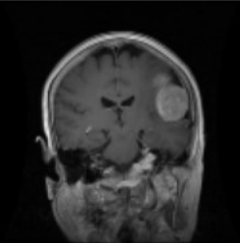
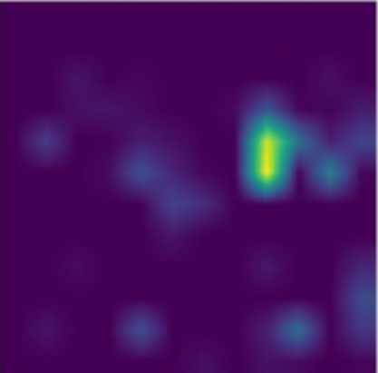
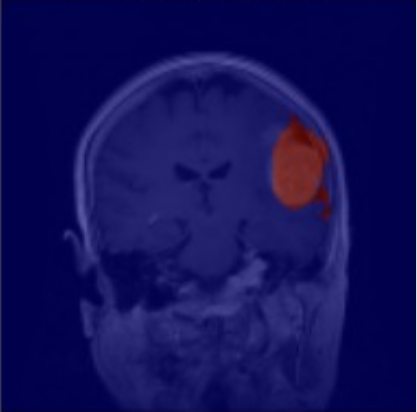
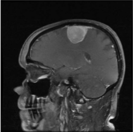
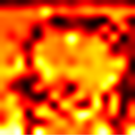
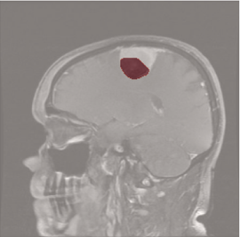

# Brain Tumor MRI Classification & Segmentation

An AI-powered system for detecting and visualizing brain tumors from MRI scans using two deep learning approaches: **CNN** and **Vision Transformer (ViT)**.

## What It Does

This project takes a brain MRI scan and:

1. **Classifies** the tumor type into one of 4 categories:
   - Glioma
   - Meningioma
   - Pituitary
   - No Tumor

2. **Visualizes Attention** - Shows which regions the AI focuses on when making its decision

3. **Segments the Tumor** - Highlights the tumor region using unsupervised learning techniques

## Two Approaches

### 1. CNN (Convolutional Neural Network)

A traditional deep learning approach using:
- 4 Convolutional layers with max pooling
- Dense layers for classification
- **Grad-CAM** for visualization
- **Test Accuracy: ~95%**

## Example

| Original MRI | Grad-Cam | Tumor Segmentation |
|:------------:|:-------------:|:------------------:|
|  |  |  |

**Prediction:** Meningioma (97.4% confidence)

### 2. ViT (Vision Transformer)

A transformer-based approach that:
- Splits images into 16×16 patches
- Processes through 15 transformer encoder layers
- Uses **Attention Rollout** for visualization
- **Test Accuracy: ~85%**

| Model | Architecture | Visualization | Accuracy |
|-------|-------------|---------------|----------|
| CNN | Convolutional layers | Grad-CAM | ~95% |
| ViT | Transformer encoders | Attention Rollout | ~85% |

## Example

| Original MRI | Attention Map | Tumor Segmentation |
|:------------:|:-------------:|:------------------:|
|  |  |  |

**Prediction:** Meningioma (92.4% confidence)

## Segmentation Approach

Since this is **unsupervised segmentation** (no ground truth masks), the system combines:

- **Attention/Grad-CAM Maps** - Extracts where the model "looks"
- **K-Means Clustering** - Groups similar intensity regions
- **Brain Masking** - Excludes skull and background
- **Adaptive Thresholding** - Finds optimal tumor boundary

## Dataset

Trained on the [Brain Tumor MRI Dataset](https://www.kaggle.com/datasets/masoudnickparvar/brain-tumor-mri-dataset) containing 7,023 MRI images across 4 classes.

## Tech Stack

- **TensorFlow/Keras** - Deep learning framework
- **OpenCV** - Image processing
- **FastAPI** - Web API
- **NumPy** - Numerical operations

## Acknowledgments

- Dataset by [Masoud Nickparvar](https://www.kaggle.com/masoudnickparvar)
- Vision Transformer architecture by [Google Research](https://arxiv.org/abs/2010.11929)
